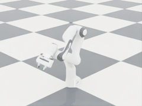
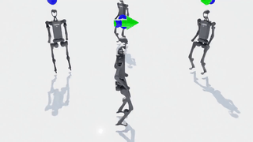
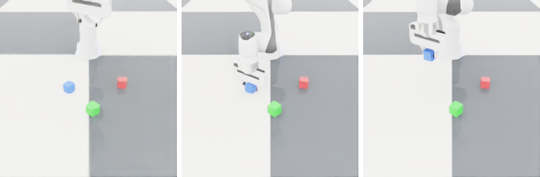

# VLM-VQA Embodied Control

A research playground for **language- and vision-driven robot control**: robot manipulation where a vision-language model (VLM) either answers questions about the scene (**VQA**) or outputs actions directly (**VLA**).

The repo builds this up in layers, from low-level control through learning to large models:
**controllers** (differential IK, null-space control) → **planners** (an LLM turns an instruction into subgoals) → **learned policies** (DAgger, PPO) → **VLAs** evaluated on standard benchmarks → **simulated VQA/VLA data** for training them.


## Core idea

The answer to a visual question can be a fact about the scene or the next action:

```python
img = camera.capture()

answer = vlm.ask(img, "Where is the red cube?")             # VQA: scene understanding -> structured state
action = vla.get_action(img, "pick up the red cube")        # VLA: answer = action (e.g. 7-D EE delta + gripper)

robot.execute(action)                                       # repeat until the task is done
```

## What's in the repo

| Area | Where | What |
|---|---|---|
| Classical control (MuJoCo) | [src/](src/), [src/llm_vlm_robot_control/](src/llm_vlm_robot_control/) | Franka pick-and-place with waypoints, UR5 differential IK with null-space obstacle avoidance (based on [mjctrl](https://github.com/kevinzakka/mjctrl)) |
| LLM planning | [src/llm_vlm_robot_control/llm_control.py](src/llm_vlm_robot_control/llm_control.py) | Qwen2.5-3B reads the instruction and scene state, returns JSON subgoals, and diff-IK executes them in MuJoCo |
| Imitation learning | [src/BC/](src/BC/) | DAgger on 2D/3D reaching arms with state, vision and fused policies |
| Benchmarks | [baseline/LIBERO/](baseline/LIBERO/), [baseline/CALVIN/](baseline/CALVIN/) | Working env setups plus a pluggable `get_action(image, instruction)` rollout loop |
| VLA evaluation | [baseline/Models/](baseline/Models/) | One `Policy` interface for OpenVLA, SmolVLA, pi0/pi0.5, RT-1, Octo, RT-2, CoT-VLA |
| Isaac Lab | [rob_envs/isaac/](rob_envs/isaac/) | Franka and H1 humanoid sims, PPO walking training, and scripted **VQA/VLA dataset collection** |


## UR5 Null Space Control


Implements differential inverse kinematics with null space control on a UR5e arm in MuJoCo. The end-effector tracks a waypoint trajectory while avoiding a spherical obstacle, with joint velocities solved via a damped pseudoinverse Jacobian.

## Isaac Lab Simulation

Minimal [Isaac Lab](https://github.com/isaac-sim/IsaacLab) 3.0 / Isaac Sim 6.1 examples in a separate `isaac_venv` (Python 3.12). See [rob_envs/isaac/](rob_envs/isaac/) for install and commands.

- **Franka arm**: scripted sinusoidal joint motion, with an optional GIF and joint-angle plot (`franka_sim.py --record`).
- **H1 humanoid walking**: NVIDIA's pretrained RSL-RL policy (`h1_walk.sh`), or train PPO from scratch with live learning-curve plots (`h1_train.sh`).
- **VQA / VLA data collection**: a scripted IK expert picks up a named cube and records `(image, instruction, action)` per step, with actions also binned to 256 text tokens. It also saves ground-truth `(image, question, answer)` pairs about the scene. See [rob_envs/isaac/vqa_data/](rob_envs/isaac/vqa_data/).

 

**VQA sample**: start → grasp → lift, instruction *"grasp the blue cube and lift it"*



| Question / instruction | Answer |
|---|---|
| Where is the blue cube in the image? (pixel x, y) | `(88, 110)` |
| What is the 3D position of the red cube in meters? | `(0.36, 0.18, 0.02)` |
| Which cube is closest to the gripper? | `blue` |
| Which cube is on the left side of the image? | `blue` |
| *grasp the blue cube and lift it* (step 0 action) | `[0.0006, -0.0042, -0.0090, 0, 0, 0, +1]` → tokens `131 101 70 128 128 128 255` |
| *grasp the blue cube and lift it* (step 47 action) | `[0, 0, 0, 0, 0, 0, -1]` (close gripper) → tokens `128 128 128 128 128 128 0` |

## LIBERO Benchmark

Baseline setup for the [LIBERO](https://github.com/Lifelong-Robot-Learning/LIBERO) manipulation benchmark, with a pluggable VLM/VLA rollout loop. See [baseline/LIBERO/](baseline/LIBERO/) for setup, scripts, and details.

 

## CALVIN Benchmark

Baseline setup for the [CALVIN](https://github.com/mees/calvin) long-horizon, language-conditioned manipulation benchmark, with the same pluggable VLM/VLA rollout loop. See [baseline/CALVIN/](baseline/CALVIN/) for setup, scripts, and details.

 

## VLA Evaluation

A shared `Policy` interface plus wrappers for OpenVLA, SmolVLA, pi0/pi0.5, RT-1, Octo, RT-2, and CoT-VLA, evaluated on the LIBERO and CALVIN baselines above. OpenVLA (real 7B, LIBERO-finetuned checkpoint), SmolVLA, and RT-1 (a stateful `tf_agents` checkpoint with real Universal Sentence Encoder instruction embeddings) are actually validated with real weights, each in its own venv (`vla_venv`/`vla_venv_lerobot`/`vla_venv_tf` - different, conflicting framework/torch-version requirements); the rest are wired up with correct loading code but not executed here (a fourth framework, multi-GB checkpoints, or no public weights at all). See [baseline/Models/](baseline/Models/) for the eval harness, per-model status, and sample results.
