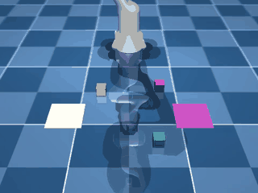
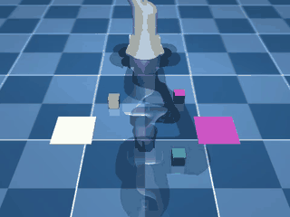
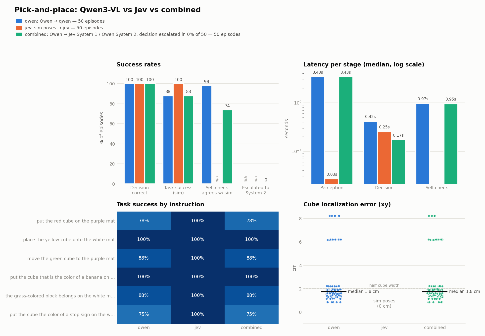
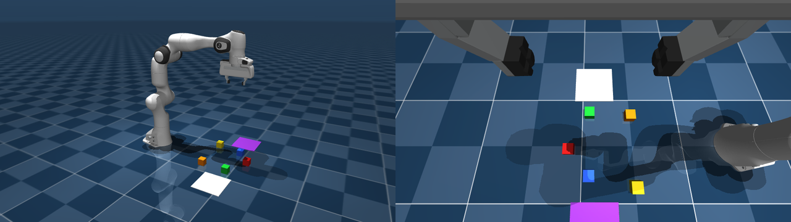
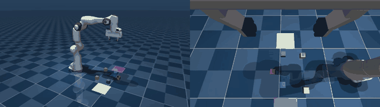
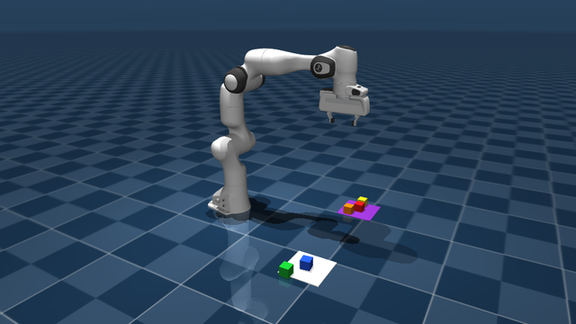

# MuJoCo + VLM manipulation (Franka Panda)

Two experiments with a Franka Panda in MuJoCo, where vision-language models make the decisions and a scripted IK
controller moves the arm:

1. **[Single pick-and-place: Qwen3-VL × Jev](#1-single-pick-and-place-qwen3-vl--jev)**: one cube to one mat, comparing a VLM, a
   decision model, and a System 1 / System 2 combination (50 episodes per mode).
2. **[Multi-step sorting: GPT family vs Qwen3-VL](#2-multi-step-sorting-gpt-family-vs-qwen3-vl)**: five cubes sorted over several
   steps by a closed-loop VLM planner that sees two camera views.

## 1. Single pick-and-place: Qwen3-VL × Jev

A Franka Panda picks a colored cube and places it on a colored mat, following a natural-language instruction
(*"put the cube that is the color of a banana on the mat that is not white"*). This setup compares two
models in different roles:

- **[Qwen3-VL-8B-Instruct](https://huggingface.co/Qwen/Qwen3-VL-8B-Instruct)**, a local vision-language model. It **sees**: from the
  camera image it returns a 2D point for each object, which is converted to 3D with the depth render.
- **[Jev](https://pydantic.dev/docs/ai/models/typesafe/)** (TypeSafe AI), a hosted *System 1* decision model. It **decides**: typed
  choices (which cube, which mat) and yes/no answers, each with a calibrated confidence. Jev is text-only.

Neither model moves the arm. A scripted controller does that: differential IK on the TCP following
approach → grasp → lift → place waypoints.

### The three modes

| Mode | Perception | Decision (pick / place) | Success self-check |
|---|---|---|---|
| `qwen` | Qwen3-VL | Qwen3-VL | Qwen3-VL looks at the final image |
| `jev` | simulator poses (no VLM) | Jev | n/a (no image description) |
| `combined` | Qwen3-VL | **Jev = System 1**, falling back to **Qwen = System 2** when Jev's confidence < 0.7 | Jev judges Qwen's description; Qwen reasons over the image if Jev is unsure |

In `combined`, Qwen's step-by-step System 2 reasoning runs only when Jev's per-field confidence
(`result.response.provider_details['confidence']`) is below `S1_CONF_THRESH`.

### Run (from repo root)

Setup: use `isaac_venv` (mujoco 3.11, transformers 5, `pydantic-ai-slim[typesafe]`), and fetch the Franka model:
```bash
git clone --depth 1 --filter=blob:none --sparse https://github.com/google-deepmind/mujoco_menagerie external/mujoco_menagerie
git -C external/mujoco_menagerie sparse-checkout set franka_emika_panda
export TYPESAFE_API_KEY=...        # needed for jev / combined
```

```bash
# one episode
MUJOCO_GL=egl isaac_venv/bin/python rob_envs/MuJoCo/jmujoco_jev.py --mode combined --seed 0 \
    --task "put the cube that is the color of a banana on the mat that is not white"

# benchmark all three modes, 50 episodes each (6 instructions, cycled over seeds), then plot
MUJOCO_GL=egl isaac_venv/bin/python rob_envs/MuJoCo/compare_modes.py --episodes 50
isaac_venv/bin/python rob_envs/MuJoCo/compare_modes.py --plot-only        # re-plot saved runs
```
Each episode writes `outputs/mujoco_jev/<mode>/seed<N>_<task>/` containing `pick_place.mp4`, `vlm_input.png`, `final.png` and
`result.json` (decisions, confidences, System 2 reasoning, timings). The sweep also writes `results.csv` and `comparison.png`.

### Demos (seed 0)

| `qwen` | `jev` | `combined` |
|---|---|---|
|  |  |  |
| *"put the cube that is the color of a banana on the mat that is not white"*: yellow → purple mat | *"the grass-colored block belongs on the white mat"*: green → white mat (Jev confidence 0.97) | *"move the green cube to the purple mat"*: Qwen called the mat "pink"; Jev still matched it (confidence 0.96) |

### Results (50 episodes per mode, real Jev API)



| Mode | Decision correct | Task success | Self-check agrees w/ sim | Decision latency (median) |
|---|---|---|---|---|
| `qwen` | 100% | 88% | 98% | 0.42 s |
| `jev` | 100% | 100% | n/a | 0.25 s |
| `combined` | 100% | 88% | 74% | **0.17 s** |

- **Decisions are solved in every mode.** Jev handled the paraphrases, negations and the pink/purple naming mismatch at high
  confidence, so `combined` never escalated to System 2 (0/50) and made the fastest decisions.
- **Task failures come from perception, not decisions.** `qwen` and `combined` share the same misses: in a few layouts
  Qwen localizes a cube 6–8 cm off (median error 1.8 cm, against a 2 cm half-cube width), and the grasp misses. `jev` uses
  exact simulator poses, so it succeeds every time.
- **Jev's success self-check is too literal.** When Qwen says *"the cube is on the **pink** mat"* and the instruction
  said *purple*, Jev confidently answers "no" (confidence 0.74–0.96, above the threshold, so the check never escalates).
  That causes 13 false negatives. Possible fixes are to describe the scene using the instruction's own object names,
  or to raise the threshold for the judge.

## 2. Multi-step sorting: GPT family vs Qwen3-VL

Five cubes (red, orange, yellow, green, blue) have to be sorted onto two mats, following one instruction that needs
several pick-and-place actions and a little reasoning:

| # | Instruction | Expected result |
|---|---|---|
| 0 | put every warm-colored cube on the purple mat and every cool-colored cube on the white mat | red, orange, yellow → purple; green, blue → white |
| 1 | move all cubes to the white mat except the blue one | blue stays where it is |
| 2 | put the cubes whose colors appear in a traffic light on the purple mat, leave the others where they are | red, yellow, green → purple |
| 3 | sort the cubes: primary colors on the white mat, all other colors on the purple mat | red, yellow, blue → white |
| 4 | put the cube that is the color of the sky on the purple mat and the cube the color of a pumpkin on the white mat | blue → purple, orange → white |

**Models.** The same prompt runs on the **GPT family** through the OpenAI Responses API (`gpt-5.5`, `gpt-5.4`,
`gpt-5.4-mini`, `gpt-5.4-nano`) and on **Qwen3-VL-8B** locally.

### How it works

Every step is one closed-loop iteration:

1. **Observe.** The robot returns to its home pose and renders **one image with two views side by side**:
   - left, **eye-to-hand**: a side view of the whole robot and the table, at the MuJoCo viewer's default angle;
   - right, **eye-in-hand**: a wrist camera beside the fingers, looking down on the table (fingertips at the top edge).
2. **Plan.** The VLM receives that image together with the instruction, the actions attempted so far, and a
   **memory of the last *m* = 3 states**: the earlier images, each labeled with the action attempted from it. It returns
   JSON with a 2D point for each cube and mat, the remaining plan, and whether the task is done. Comparing consecutive
   states lets it notice failures, such as a cube that did not move after a missed grasp, and retry. This feedback is
   purely visual; no success signal from the simulator is given to the model.
3. **Ground.** The half of the image a point falls in decides which camera's depth converts it to 3D. Cubes come
   preferably from the top-down wrist view, mats from the side view.
4. **Act.** Only the **first** action of the plan runs: approach → grasp → lift → place in a free slot on the mat. Then
   the loop starts again with a new observation (up to 8 actions per episode).


*What the VLM sees at each step: eye-to-hand side view (left) and eye-in-hand wrist view (right).*

### Demo: GPT-5.5, task 0

*"put every warm-colored cube on the purple mat and every cool-colored cube on the white mat"*



GPT-5.5 solved it in **5 actions, with no missed grasps**: orange, red and yellow went to the purple mat, then green and
blue to the white mat, and on the 6th call it correctly reported the task as done. It also followed the grounding hint,
taking every cube's point from the wrist view and every mat's point from the side view. The episode cost $0.32
(about 9.8k input and 9.1k output tokens) and took about 3 minutes, mostly spent on 16–31 s planner calls.
This run used no memory (*m* = 0), since it predates that feature.



### First observations (single episodes, task 0, seed 0)

These are single runs, not a benchmark. Use `sweep` for proper numbers.

| Model | Grounding | Result | Notes |
|---|---|---|---|
| `gpt-5.5` | VLM points | **5/5 cubes, success** | 5 actions, no misses, $0.32 |
| `gpt-5.4-mini` | VLM points | 0/5 | right plan, but its points were 6–92 cm off (typically 7–13 cm), so every grasp missed |
| `gpt-5.4-mini` | simulator poses (`--perception gt`) | 4/5 | every grasp landed, but it re-moved cubes already on the right mat and ran out of steps before blue |
| `qwen` (Qwen3-VL-8B) | VLM points | 0/5 | with memory it noticed the miss and retried, but gave the same offset point each time |

What this shows so far:
- **Pointing is the main bottleneck for the smaller models.** Planning is mostly right, but a 4 cm cube needs a point
  within about 2 cm, and only GPT-5.5 got there.
- **Memory helps the model notice failures but not fix them.** The models retry a missed grasp, but repeat the same
  inaccurate point.
- **Next steps:** Set-of-Mark grounding (the VLM picks numbered marks on segmented objects instead of writing
  coordinates), and a wrist close-up just before each grasp to refine the point.

### Run (from repo root)

```bash
pip install openai            # in isaac_venv
export OPENAI_API_KEY=...

# one episode
MUJOCO_GL=egl isaac_venv/bin/python rob_envs/MuJoCo/jmujoco_api_llm.py run --model gpt-5.5 --task 0 --seed 0

# benchmark several models over all tasks, then plot
MUJOCO_GL=egl isaac_venv/bin/python rob_envs/MuJoCo/jmujoco_api_llm.py sweep \
    --models gpt-5.4-nano gpt-5.4-mini gpt-5.4 gpt-5.5 qwen --seeds 0 1
isaac_venv/bin/python rob_envs/MuJoCo/jmujoco_api_llm.py plot     # re-plot saved runs
```

| Flag | Meaning |
|---|---|
| `--model` / `--models` | `gpt-5.5`, `gpt-5.4`, `gpt-5.4-mini`, `gpt-5.4-nano`, or `qwen` (local) |
| `--memory M` | past (state image, action) pairs shown each step; default 3, `0` = no memory |
| `--views both\|scene\|wrist` | which camera views go into the image (default `both`, side by side) |
| `--perception gt` | use simulator poses, so the VLM only plans (separates planning errors from pointing errors) |
| `--effort low\|medium\|high` | GPT reasoning effort |

Each episode writes `outputs/mujoco_llm/<model>[_gt][_<views>][_mem<M>]/seed<N>_task<K>/`, containing `step_<k>.png`
(the exact image the VLM saw), `episode.mp4` (both views side by side), `final_front.png`, `final_wrist.png` and
`result.json`. The JSON holds the plans, actions, where each cube landed, tokens, cost, latency, and diagnostic aim errors
against the simulator, which are never shown to the model. The sweep also writes `results.csv` and `comparison.png`.

## Files

| File | What it does |
|---|---|
| `jmujoco_jev.py` | Experiment 1: scene (built with `MjSpec`), Qwen perception, the Jev / Qwen / cascade `Decider`, IK controller, `run_episode()` |
| `compare_modes.py` | Experiment 1: benchmark sweep over modes × tasks × seeds, `results.csv`, `comparison.png` |
| `jmujoco_api_llm.py` | Experiment 2: 5-cube scene, side + wrist cameras, GPT / Qwen planners, memory, closed-loop `run_episode()`, sweep + plot |
| `assets/` | Demo GIFs, images and plots used in this README |
